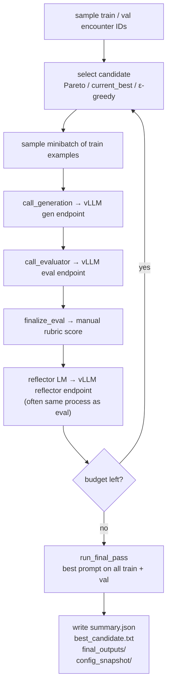
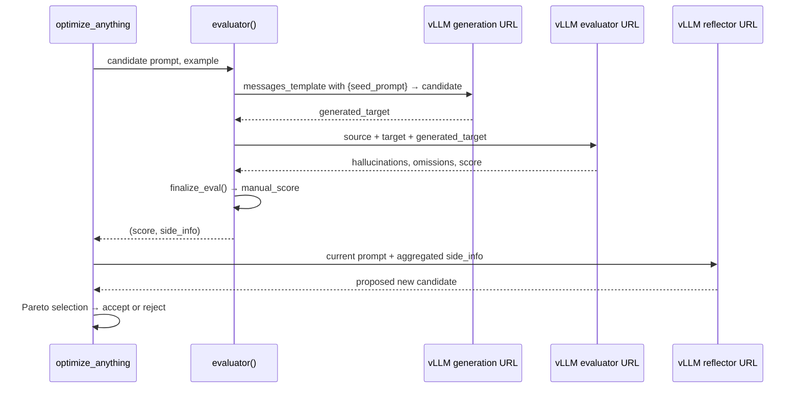

# GEPA Pipeline

This folder contains a GEPA prompt-optimization pipeline for clinical note generation from ACI-Bench train/valid data.

## Pipeline Architecture




What happens inside one evaluation call:




## Workflow

1. Prepare prompts locally from the original ACI-Bench repo (67 train + 20 valid encounters available):

```bash
uv run --with pyyaml python3 gepa/prepare_gepa_prompts.py
```

1. Push prepared prompts and GEPA scripts to Anvil:

```bash
make push-anvil
```

1. Submit batch job (recommended — 12h, 2× H100):

```bash
sbatch slurm/gepa_run.slurm
```

1. Pull outputs locally and plot a run:

```bash
make pull-anvil
uv run --with matplotlib python3 gepa/plot_gepa_run.py outputs/optimizers/gepa/<timestamp>
```

## Configuration

See `config.yaml` for data sizes, GEPA budgets, **`models`** and **`endpoints`**. Server startup uses `gepa/servers/vllm_model_flags.py --serve-plan` so vLLM bind addresses match those URLs. Key defaults:


| Parameter                      | Value  |
| ------------------------------ | ------ |
| `train_n`                      | 50     |
| `val_n`                        | 20     |
| `max_metric_calls`             | 200    |
| `reflection_minibatch_size`    | 5      |
| `candidate_selection_strategy` | pareto |
| `frontier_type`                | hybrid |


Merge (`MergeConfig`) and refiner (`RefinerConfig`) are enabled in `run_gepa_pipeline.py`.

## Folder layout

```text
gepa/
├── README.md
├── config.yaml
├── run_gepa_pipeline.py
├── prepare_gepa_prompts.py
├── plot_gepa_run.py
├── verify_pipeline.py
├── prompts/
│   ├── evaluator_prompt_template.json
│   └── generation_seed_prompt.txt
├── servers/
│   ├── start_vllm_servers.sh
│   ├── stop_vllm_servers.sh
│   ├── check_vllm_servers.py
│   ├── vllm_model_flags.py
│   └── pids/                 # runtime PID files (gitignored)
└── docs/
    ├── RUNBOOK.md
    ├── ANVIL_QUICKSTART.md
    └── gepa_paper.md
```

## Files

- `config.yaml`: default GEPA run config (`paths.*` point at `prompts/` data and `gepa/prompts/` templates).
- `prepare_gepa_prompts.py`: builds `prompts/gepa/<encounter_id>/<train|valid>/prompt.json`.
- `run_gepa_pipeline.py`: runs GEPA using prepared prompts, vLLM model servers, manual scoring, and trace logging.
- `gepa/prompts/generation_seed_prompt.txt`: seed system prompt optimized by GEPA (default `--seed-prompt`).
- `gepa/prompts/evaluator_prompt_template.json`: evaluator prompt for hallucination/omission detection.
- `servers/start_vllm_servers.sh`, `servers/check_vllm_servers.py`, `servers/stop_vllm_servers.sh`, `servers/vllm_model_flags.py`: Anvil model-server helpers.
- `plot_gepa_run.py`: creates plots and Markdown reports from a run directory.
- `docs/ANVIL_QUICKSTART.md`: short copy/paste Anvil run sheet.
- `docs/RUNBOOK.md`: longer operational notes.
- `docs/gepa_paper.md`: paper notes.

